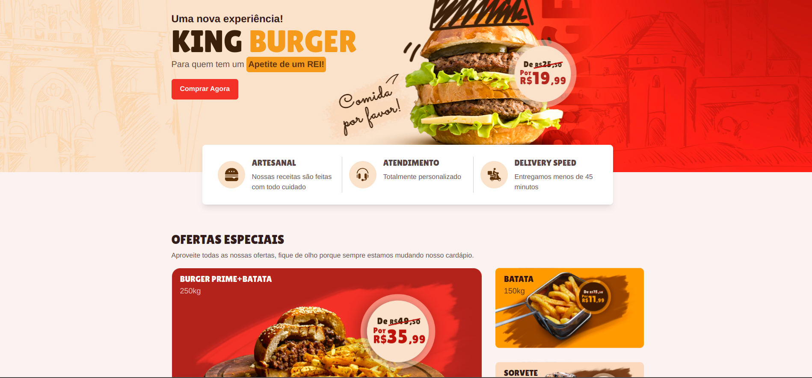

  

## 💻 Projeto

Esse projeto é uma landing page de uma hamburgueria fictícia chamada **Empire Burger**, nela há seções sobre as ofertas especiais, horário de funcionamento, cardápio contendo os ingredientes e preços, cards com os feedbacks dos clientes e a localização do estabelecimento.

Para facilitar a codificação do projeto foi usado um protótipo do figma como base, o autor do layout é o design [**Tiago Alves**](https://www.behance.net/tiagofenixe9d9), [clique aqui](https://www.figma.com/file/ag4Az50adOF53pBrwI0wFg/Empire-Burger?node-id=0%3A1) para abrir o protótipo no figma.

## 🚀 Tecnologias

## 📝 Critérios de aceite

- [ ] Criar as seguintes seções:
- [x] Menu
- [x] Hero Banner
- [x] Ofertas especiais
- [x] Horário de funcionamento
- [x] Cardápio
- [ ] Footer

- [ ] Ao clicar em um item do menu, o usuário deverá ser levado para a seção correspondente.

- [x] Na seção Ofertas especiais os elementos devem ser organizados com o uso da propriedade display:grid do css.

- [x] As informações do card da oferta(nome do prato e gramagem) devem estar no html, a única imagem deve ser a foto do prato com o preço.

- [ ] Na seção onde fica o nosso castelo você deverá incorporar uma localização do google maps.

## 👤 Author

<h3>
  <b>Danyel Varejão</b>
</h3>

<li>Github: <a href="https://www.github.com/danyelvarejao">Danyel Varejão</a></li>
<li>Linkedin: <a href="https://www.linkedin.com/in/danyelvarejao">Danyel Varejão</a> </li>
<li>Discord: Danyel#4808</a></li>
 